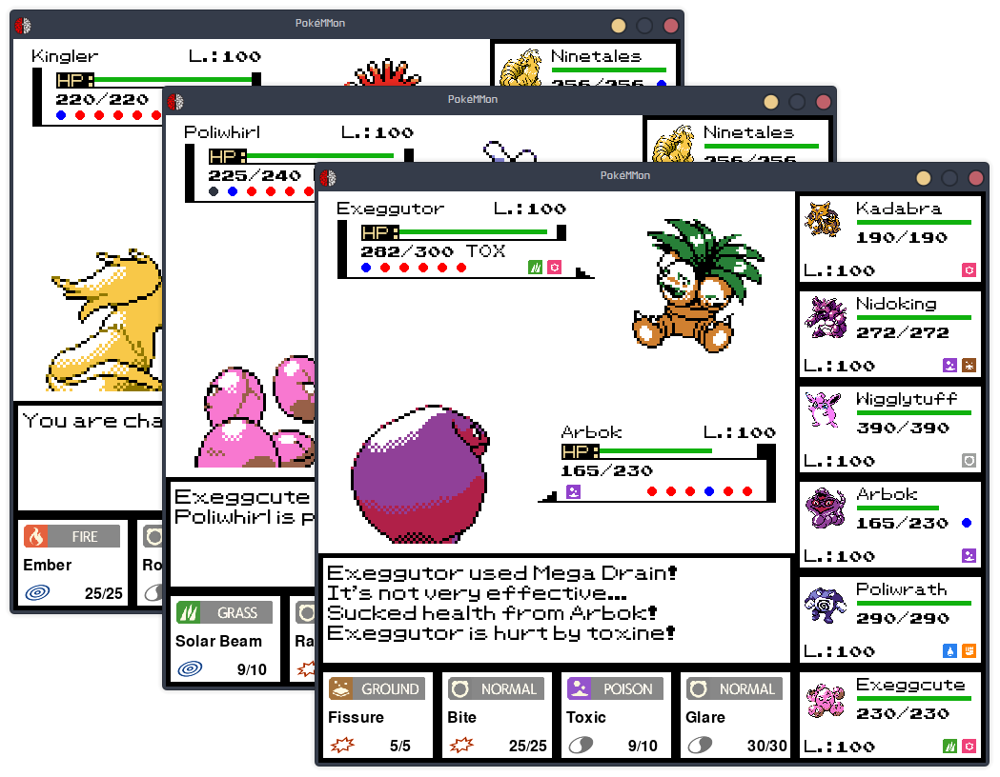
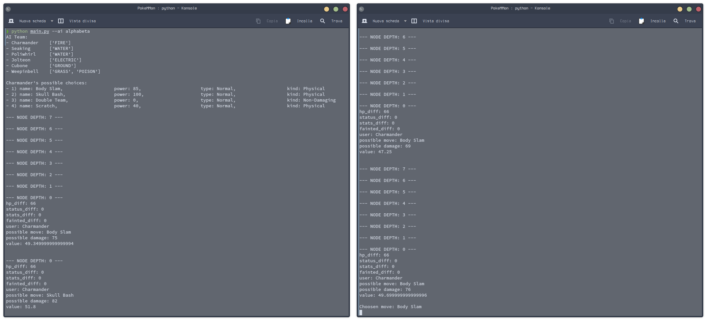

<h1 align="center">
  
  <br>
  <b>PokéMMon</b>
  <br>
  <sup><sup>(Pokémon battles <b>M</b>ini<b>M</b>ax simulator)</sup></sup>
</h1>

This is a *Pokémon* battles' implementation with the use of MiniMax-type algorithms, developed as project for the Artificial Intelligence course (university subject).

All credits of the material used (characters, sounds, images and ideas) belong to The Pokémon Company, Nintendo, Game Freak and Creatures Inc.

<div align="center">
  
</div>

## Description
This Python software is a *PyGame* re-implementation of the 1st gen. Pokémon games' (Red/Blue/Yellow versions) **battle system**, with some QoL changes and bugfixes from the 2nd gen. (Gold/Silver/Crystal) ones.
It implements **MiniMax-type algoritms** to move the CPU player.\

These are the possible **algorithms** that could move the rival agent:
- MiniMax (vanilla);
- Alpha-Beta pruning MiniMax;
- ExpectiMax.

## Usage
### Dependencies
- Python 3.10
- `pygame` module

### Installation
After ensuring that Python $\geq$ 3.10 is installed on your personal environment (*GNU/Linux*, *Windows*, *MacOS*), install the `pygame` module through the command:
```
pip install pygame
```
Then, make a `git clone` of this repository or simply download it.

### Execution
Run the `main.py` script in the root of the cloned folder to play the game.

```
python main.py -h

usage: main.py [-h] [--ai AI] [--depth DEPTH] [--s S]

Pokémon combat system (1st gen) re-implementation using MiniMax-type algorithms.                                            
Author: nebuchadneZZar01 (Michele Ferro)                                            
GitHub: https://github.com/nebuchadneZZar01/PokeMMon                                            
All credits of the material used (characters, sounds, images and ideas) belong to The Pokémon Company, Nintendo, Game Freak and Creatures Inc.

options:
  -h, --help     show this help message and exit
  --ai AI        artificial intelligence algorithm used
                 [random/minimax/alphabeta/expectimax] (default: minimax)
  --depth DEPTH  maximum depth of the nodes to visit in game's tree (default: 7)
  --s S          sound [Y/n] (default: yes)
```
Example using *Alpha-Beta pruning* algorithm (default depth), with sound activated:
```
python main.py --ai alphabeta --s y
```
During the execution of the game you could see the following logs on the commandline, explaining the algorithm(s) computations (which are correlated to the agent moves).

<div align="center">
  
</div>

## Known bugs
- When using a non-damaging move that updates the stats multiplier (like "Growl", "Tail Whip", "Double Team" and so on), the first time the text message will say that the Attack stat is being updated (despite is actually being updated the actual stat); the next times, this will not happen and the actual stat will be displayed on the Text Message.  

## Author
- [@nebuchadneZZar01](https://github.com/nebuchadneZZar01) (Michele Ferro)
